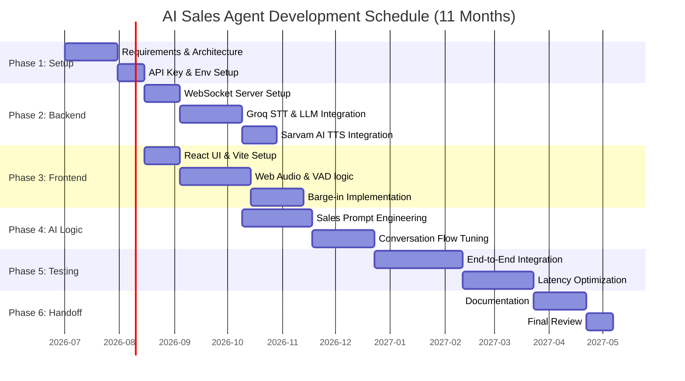
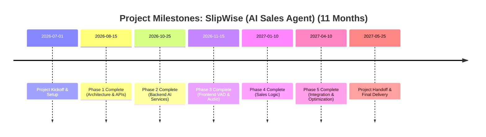
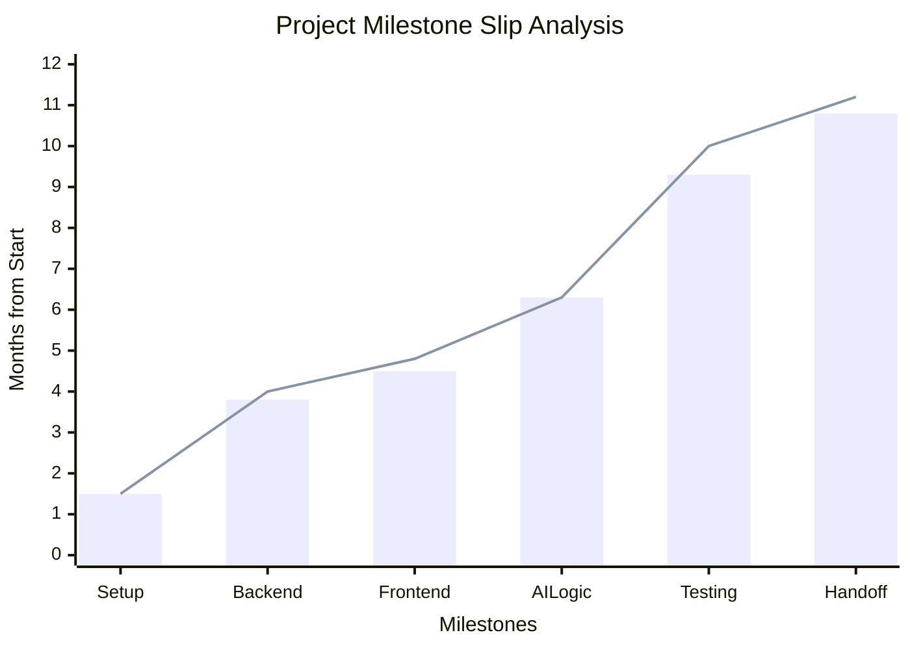

# Project Planning and Tracking: SlipWise (AI Sales Agent)

## 1. Project Overview
This project focuses on the development of a customizable, AI-powered voice sales agent tailored as a generic B2B/B2C sales solution. The voice agent features real-time voice interaction, natural English language support, adaptive Voice Activity Detection (VAD) for noisy environments, and user barge-in support.

The technology stack utilizes React/Vite for the frontend and Node.js/Express with WebSockets for the backend. AI integrations include Groq for Speech-to-Text (Whisper) and LLM (Llama 3.1), and Sarvam AI for Text-to-Speech synthesis.

## 2. Work Breakdown Structure (WBS)
To effectively plan and track the project, the scope has been divided into the following structured phases:
- **Phase 1: Planning & Setup** (Requirements gathering, System architecture design, API key procurement)
- **Phase 2: Backend Development** (WebSocket server setup, Groq STT & LLM integration, Sarvam AI TTS streaming)
- **Phase 3: Frontend Development** (React UI setup, Web Audio API implementation, VAD logic, Barge-in handling)
- **Phase 4: Sales Logic & AI Tuning** (System prompt engineering for generic sales stages, conversation flow tuning)
- **Phase 5: Integration & Testing** (End-to-end audio streaming, latency optimization, conversational testing)
- **Phase 6: Deployment & Handoff** (Documentation, final review, and code handoff)

---

## 3. Gantt Chart (Detailed Task Scheduling)
The Gantt chart illustrates the baseline schedule for all development tasks, highlighting dependencies and the expected duration for each module.

---

## 4. Timeline Chart (Sequential Milestone Mapping)
The Timeline Chart provides a high-level sequential view of the major project milestones, from the initial kickoff to the final delivery.

---

## 5. Slip Chart (Variance Analysis)
The Slip Chart is used to track deviations from the baseline schedule by comparing the **Planned Completion** time against the **Actual Completion** time for each milestone. 

*Note: The actual data in this chart simulates a scenario where minor delays occurred during backend development and integration, demonstrating how variance is tracked.*

### Variance Tracking Breakdown
This table accompanies the slip chart to provide a detailed view of schedule deviations and recovery status.

| Milestone | Planned Completion | Actual Completion | Variance (Slip) | Status/Notes |
| :--- | :--- | :--- | :--- | :--- |
| **M1: Setup Complete** | Month 1.5 | Month 1.5 | 0 Months | On Track |
| **M2: Backend Services**| Month 3.8 | Month 4.0 | +0.2 Months | Delayed (API Rate limits) |
| **M3: Frontend VAD** | Month 4.5 | Month 4.8 | +0.3 Months | Delayed (Audio config complexity) |
| **M4: AI Logic Tuned** | Month 6.3 | Month 6.3 | 0 Months | Schedule Recovered |
| **M5: Integration** | Month 9.3 | Month 10.0 | +0.7 Months | Delayed (Latency issues) |
| **M6: Final Handoff** | Month 10.8 | Month 11.2 | +0.4 Months | Completed Late |
